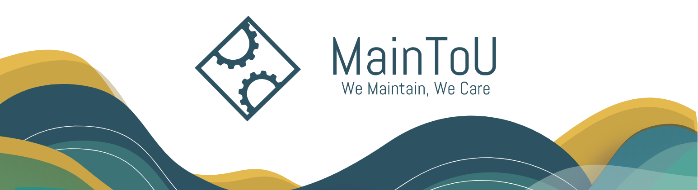

# MaintToU | Web Application Software (MERN)
## Table of Contents
- [Table of Contents](#table-of-contents)
  - [Project Description](#project-description)
  - [Technologies](#technologies)
  - [User Stories](#user-stories)
    - [Client Stories](#Client-stories)
    - [TechMan Stories](#TechMan-stories)
    - [Admin Stories](#Admin-stories)
  - [WireFrames](#wireframes)
  - [UseCase & ER Diagram](#usecase--er-diagram)
  - [Mood Board](#mood-board)
  - [Development Process](#development-process)
  - [Future Goals](#future-goals)
  - [Final result](#final-result)
  - [MainToU Team](#flancer-team)
  - [References](#references)
### Project Description
***
MainToU is the first place to go once a tech issue occurred, it will help any company of any industry that faced a the technical issue to find the appropriate maintained company, easily book an available appointment from the appointments calendar, and edit, cancel the booked appointment, with the ability to track the appointment status whether it’s confirmed, in progress or finished to be aware of any changes, MainToU cares, strives to help, to be the bridge for solving your issues. MainToU is a full-Stack Web Application, we used MEARN stack technologies to build MainToU and with different technologies to be illustrated.

## Technologies
***
A list of technologies used within the project:
|#| Name |  
| ------ |------ |  
|1| MongoDB | 
|2| Express |
|3| React.js |
|4| Node.js |
|5| Ant Design System |

#### Additional Packages:
|#| Package |  
| ------ |------ |  
|1| moment | 
|2| react-highlight-words |
|3| mongoose |

## User Stories
***
### Client Stories
1. As a client, I should be able to register on the website.
2.  As a client, I should be able to login/logout to the website.
3.  As a client, I should be able to edit my profile after creation.
4. As a client, I should be able to navigate between the website's sections.
5.  As a client, I should be shown all the available appointments from the calendar.
6.  As a client, I should be able to book a new appointment.
7.  As a client, I should be able to read my booked appointment.
8.  As a client, I should be able to update my booked appointment.
9.  As a client, I should be able to delete my booked appointment.
10.  As a client, I should be able to track my appointment status
11.  As a client, I should be able to read all my booked appointments.
12.  As a client, I should be able to rate my finished appointment.
 ### Tech-Man Stories

1. As a Tech Man I should be able to login/logout to the website.
2 As an Tech Man I should be able to change the appointenment status, confirmed\ in progress\ finished. 

### Admin Stories

1.  As an admin, I should be able to login/logout to the website.
2.  As an admin, I should be able to add a new maintenance company.
3.  As an admin, I should be able to add a new Tech Man.
4- As an admin, I should be able to edit the added maintenance company.
5.  As an admin, I should be able to edit the added Tech Man.
6.  As an admin, I should be able to delete a maintenance company.
7.  As an admin, I should be able to delete a Tech Man.
8.  As an admin, I should be able to search for a maintenance company.
9.  As an admin, I should be able to search for a Tech Man.
## WireFrames
***
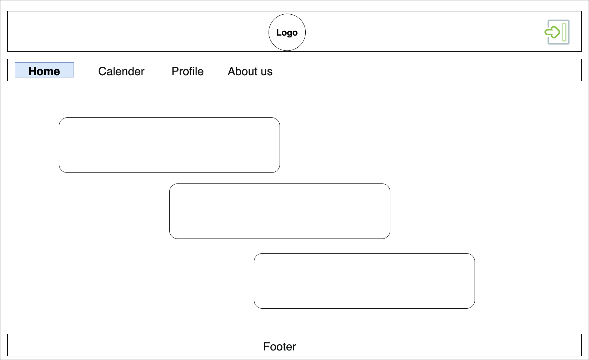
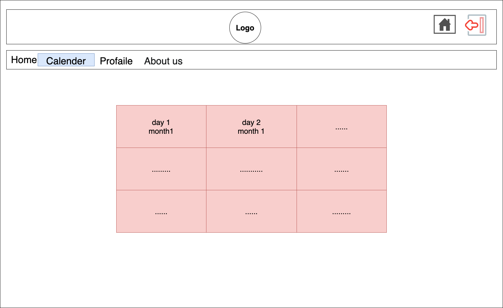
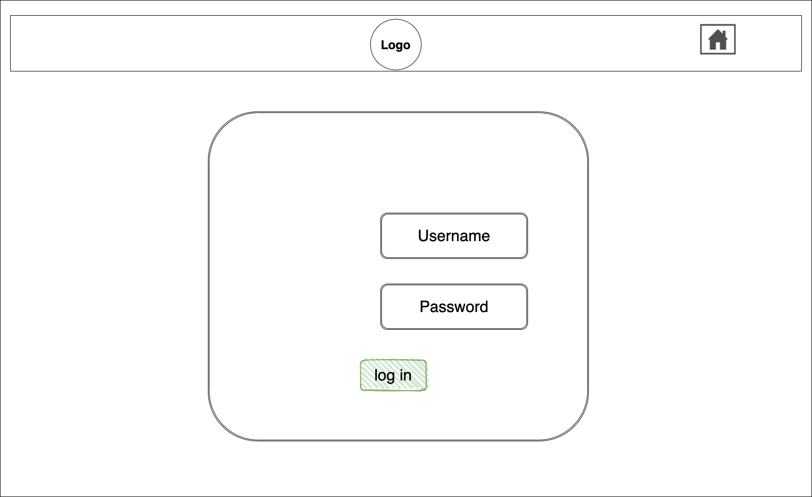
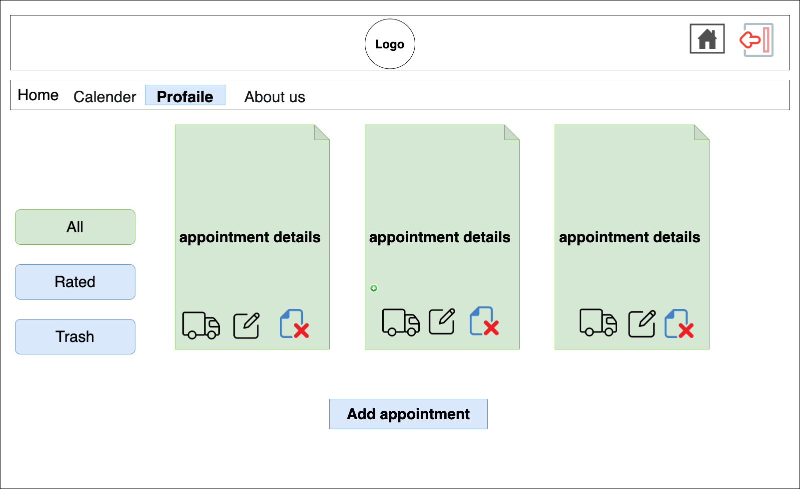
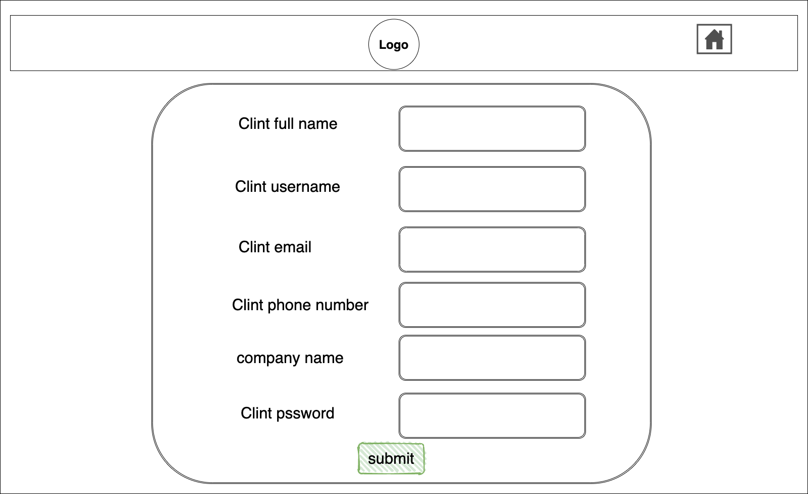
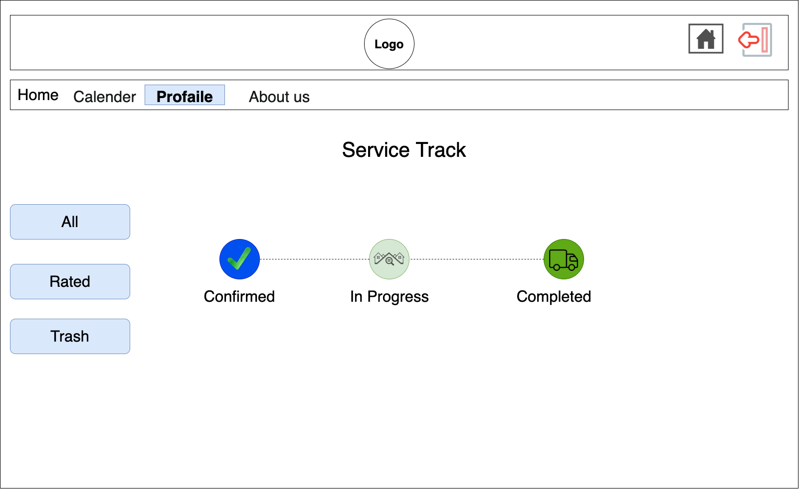
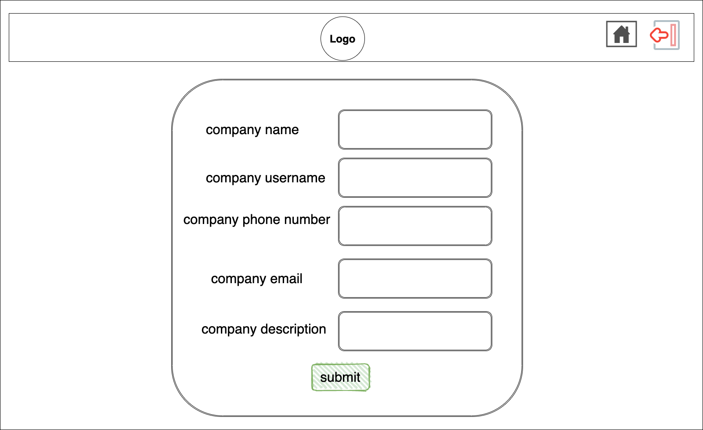
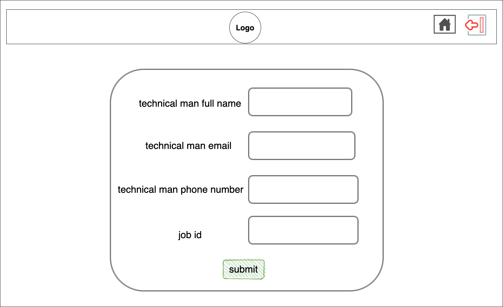

## UseCase & ER Diagram
***
The ER Diagram and Use Case Diagram to clarify the functionalities associated with our users.

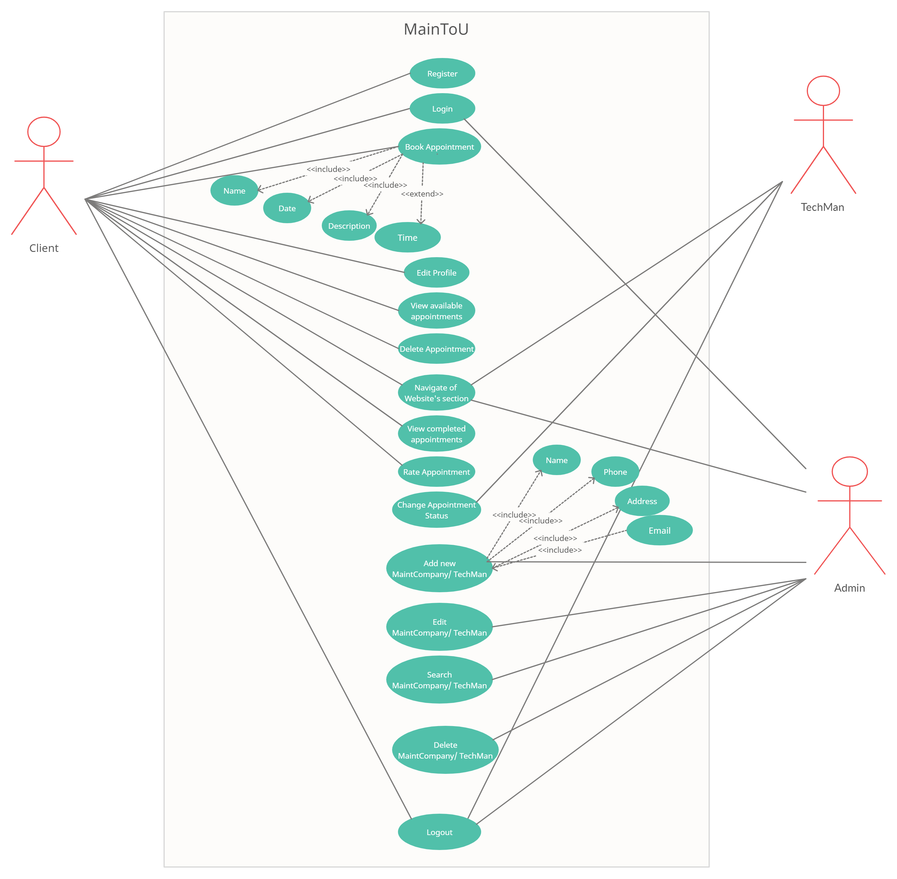

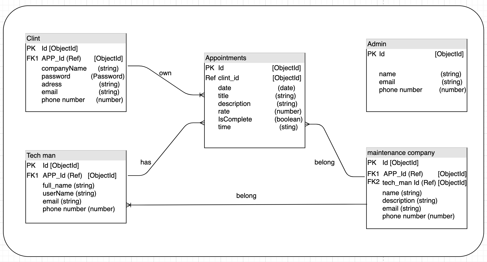

## Mood Board
***
Our Mood Board that we got inispired with, along with our logo, color palette, and fonts.

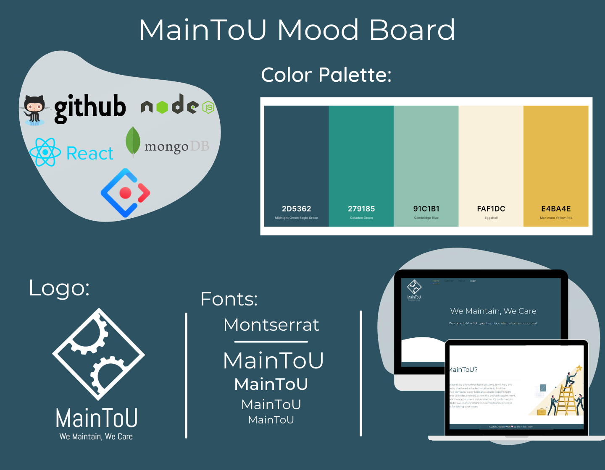

## Development Life Cycle
***
Starting with creating the wireframes, ER Diagram, UseCase Diagram and listing the User Stories to visualize the final result and simplify the development process, helps to accomplished the requirements and achieved the goals and stretcher goals.

## Future Goals
***
- Adding the Tracking Feature.
- Adding a third-party API.
- link calendar from Database.
- Adding a checkout payment method.
- Adding more functionalites to the profile

## Final result
***

## MainToU | The Team
***
The team at MainToU shares the vision and values of our community. We’re driven by the idea that the best work is born from collaboration, craftsmanship, and passion. created with care, and love to be the first place to go once an issue occurred, to help those who suffer from finding the best technical man by Abeer Albawardi, Amani Alosaimi, Aseel Alqasem, Raghad Abo Mansour and Hind Alzahrani at SEI-14.

## References
***
- [Ant Design](https://ant.design/)
- [MongoDB](https://www.mongodb.com/cloud/atlas)

